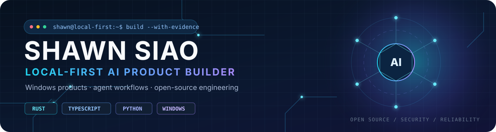
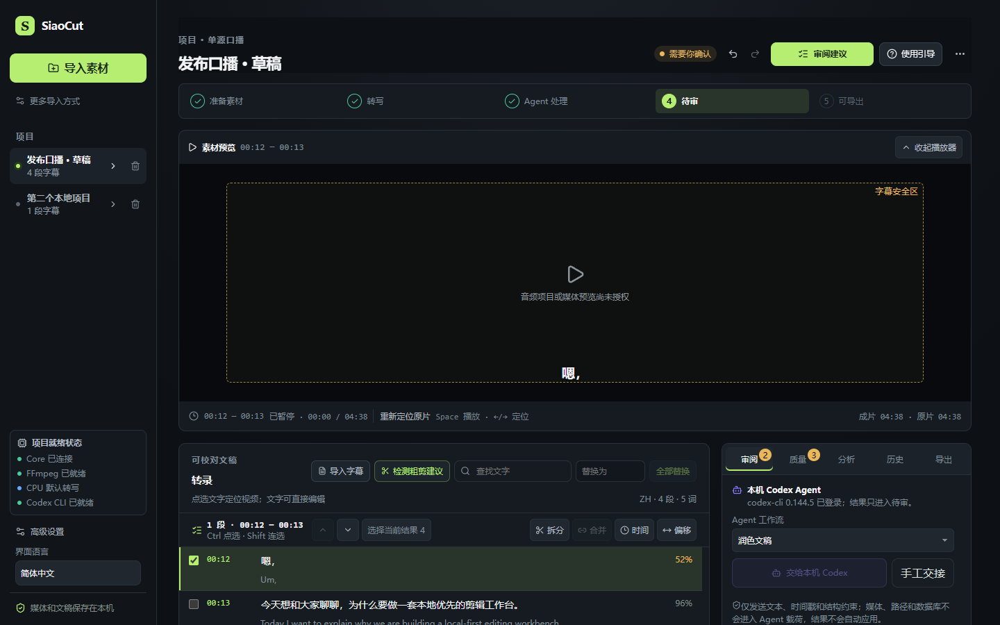
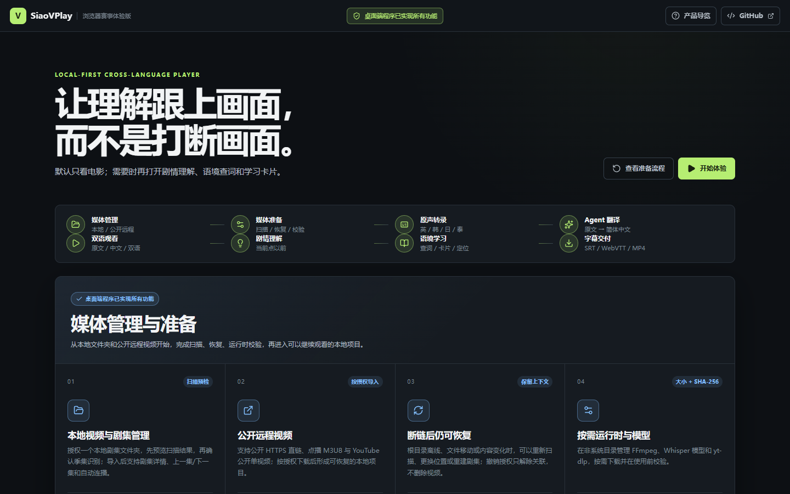
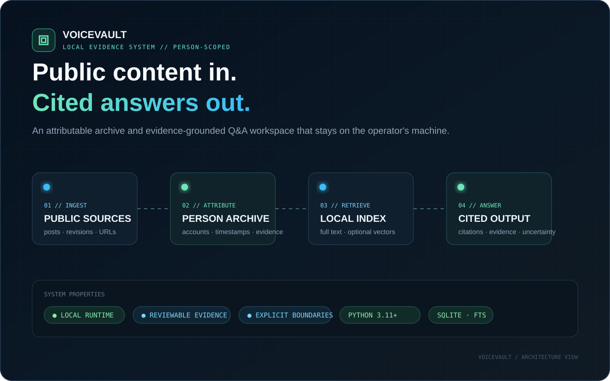
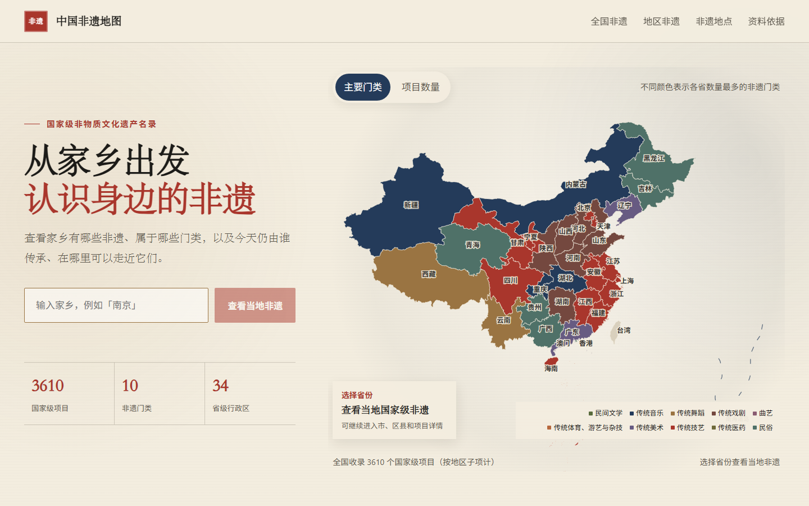

  

<strong>Building practical AI software for Windows with Rust, TypeScript and Python.</strong>

  

<table width="100%">
<tr>
<td align="center" width="33%"><strong>04</strong> SELECTED PRODUCTS</td>
<td align="center" width="34%"><strong>OPENAI · HUGGING FACE · APACHE</strong> OPEN-SOURCE CONTRIBUTIONS</td>
<td align="center" width="33%"><strong>SECURITY · HARNESS</strong> RESEARCH &amp; REPORTS</td>
</tr>
</table>

 

[Products](#01--selected-products) · [Open source](#02--open-source-contributions) · [Issues and discussions](#03--beyond-pull-requests) · [More work](#04--more-work)

---

## 01 — Selected products

<table>
<tr>
<td width="50%" valign="top">

 

WINDOWS DESKTOP · RUST · AI VIDEO

### [SiaoCut](https://github.com/ShawnSiao/siao-cut)

A Windows-local-first AI video editing workbench. It combines transcription, subtitle editing, translation and review while keeping remote AI output under explicit human control.

[Repository](https://github.com/ShawnSiao/siao-cut) · [Live browser demo](https://shawnsiao.github.io/siao-cut-hackathon-demo/)

</td>
<td width="50%" valign="top">

 

WINDOWS DESKTOP · RUST · LANGUAGE

### [SiaoVPlay](https://github.com/ShawnSiao/siao-vplay)

A cross-language intelligent video player for Windows, built around local media libraries, subtitles, translation and learning workflows.

[Repository](https://github.com/ShawnSiao/siao-vplay) · [Live browser demo](https://shawnsiao.github.io/siao-vplay-hackathon-demo/)

</td>
</tr>
<tr>
<td width="50%" valign="top">

 

LOCAL DATA · PYTHON · KNOWLEDGE

### [VoiceVault](https://github.com/ShawnSiao/voicevault)

A local-first public-content archive and evidence-grounded personal knowledge base, with explicit data and security boundaries.

[Repository](https://github.com/ShawnSiao/voicevault)

</td>
<td width="50%" valign="top">

 

PUBLIC DATA · TYPESCRIPT · MAP

### [China ICH Map](https://github.com/ShawnSiao/intangible-cultural-heritage-static)

A public-facing map for exploring China's intangible cultural heritage by place, designed with a reviewed public-data boundary.

[Repository](https://github.com/ShawnSiao/intangible-cultural-heritage-static) · [Explore the map](https://shawnsiao.github.io/intangible-cultural-heritage-static/)

</td>
</tr>
</table>

## 02 — Open-source contributions

I contribute code, documentation and Chinese localization to projects I actually use:

- [OpenAI Agents SDK for Python](https://github.com/openai/openai-agents-python/pulls?q=is%3Apr+author%3AShawnSiao) — documentation and example fixes
- [Hugging Face Agents Course](https://github.com/huggingface/agents-course/pulls?q=is%3Apr+author%3AShawnSiao) — Simplified Chinese translation and documentation improvements
- [Apache ShenYu](https://github.com/apache/shenyu/pulls?q=is%3Apr+author%3AShawnSiao) — client, integration-test and code improvements
- [LeRobot documentation](https://github.com/tc-huang/lerobot/pulls?q=is%3Apr+author%3AShawnSiao) — Simplified Chinese simulation and inference guides

## 03 — Beyond pull requests

I publish reproducible issue reports and source-backed technical discussions, with evidence that others can rerun and verify.

<strong>More — OpenAI issues and Codex Security reports</strong>

 

- [openai/codex-security#31](https://github.com/openai/codex-security/issues/31) — found queued full session-tree rescans that could delay cost-budget enforcement; closed as completed with a contributor fix
- [openai/codex-security#30](https://github.com/openai/codex-security/issues/30) — reported corrupted multiscan artifacts being treated as completed and skipped; currently an open P1 bug
- [openai/codex-security#211](https://github.com/openai/codex-security/issues/211) — reported cleanup failures that can mask a scan outcome and suppress its repository receipt; currently an open P1 bug
- [openai/codex-security#32](https://github.com/openai/codex-security/issues/32) — reproduced a Windows CRLF package-validation failure; the fix landed in PR #436 and I verified it in the published 0.1.17 package
- [OpenAI Codex issue reports](https://github.com/openai/codex/issues?q=is%3Aissue+author%3AShawnSiao) — documentation drift, runtime requirements and compatibility regressions

 

<strong>More — DeepSeek Harness technical discussions (5)</strong>

 

- [MCP tools/list duplicate cursors can cause an infinite synchronization loop](https://github.com/deepseek-ai/deepseek-harness/discussions/2285)
- [TokenMeter rebuilds a full snapshot after every session event](https://github.com/deepseek-ai/deepseek-harness/discussions/238)
- [storage-sqlite can take over an unversioned external SQLite database](https://github.com/deepseek-ai/deepseek-harness/discussions/2322)
- [Repeated SDK initialization and failed initialization can contaminate runtime state](https://github.com/deepseek-ai/deepseek-harness/discussions/253)
- [Case-insensitive Session IDs can collide in the Windows JSONL backend](https://github.com/deepseek-ai/deepseek-harness/discussions/249)

[View all DeepSeek Harness discussions →](https://github.com/deepseek-ai/deepseek-harness/discussions?discussions_q=author%3AShawnSiao)

## 04 — More work

- [siao-skills](https://github.com/ShawnSiao/siao-skills) — reusable Agent Skills for research, writing, visualization and automation
- [Personal Knowledge Site](https://shawnsiao.github.io/personal-knowledge-site/) — practical notes and reusable engineering knowledge
- [Village of a Thousand Words](https://shawnsiao.github.io/village-of-a-thousand-words/) — an interactive Chinese learning experience

## 05 — Engineering principles

- Start from a real user workflow and ship something runnable.
- Prefer local-first architecture when privacy, large media or user control matters.
- Keep AI suggestions reviewable instead of silently applying model output.
- Treat demos, tests, documentation and release boundaries as part of the product.

---

<code>BUILD USEFUL SOFTWARE · DOCUMENT THE DECISIONS · CONTRIBUTE THE FIXES BACK</code>

